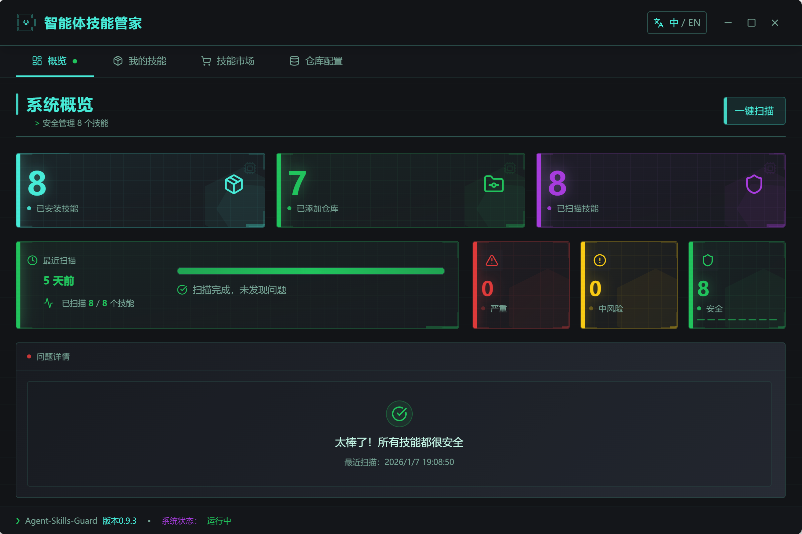
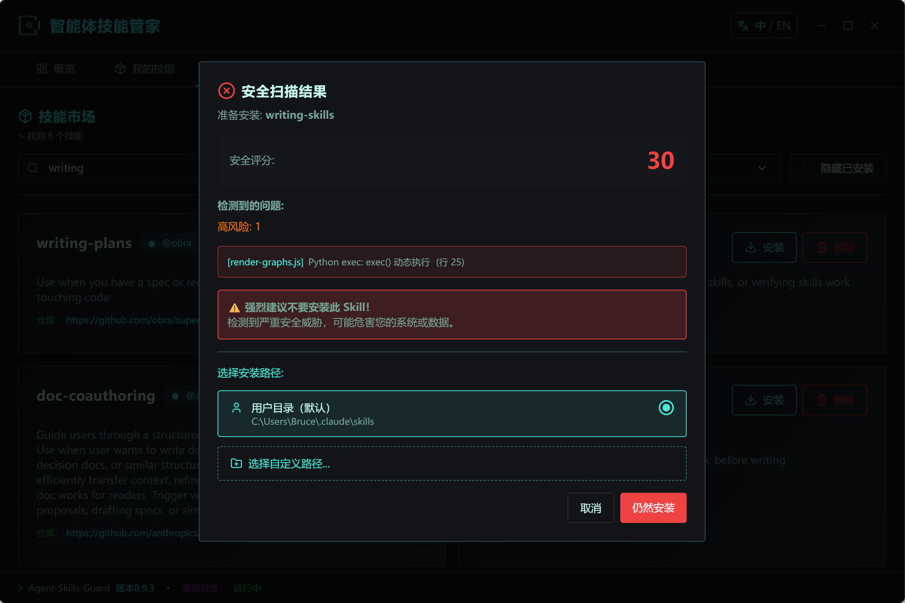
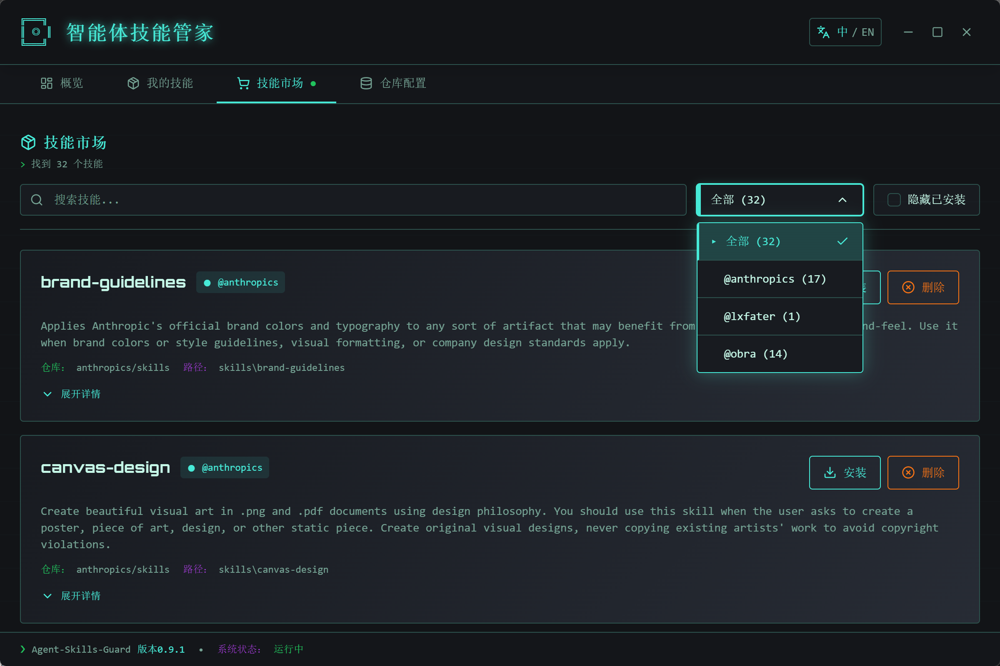
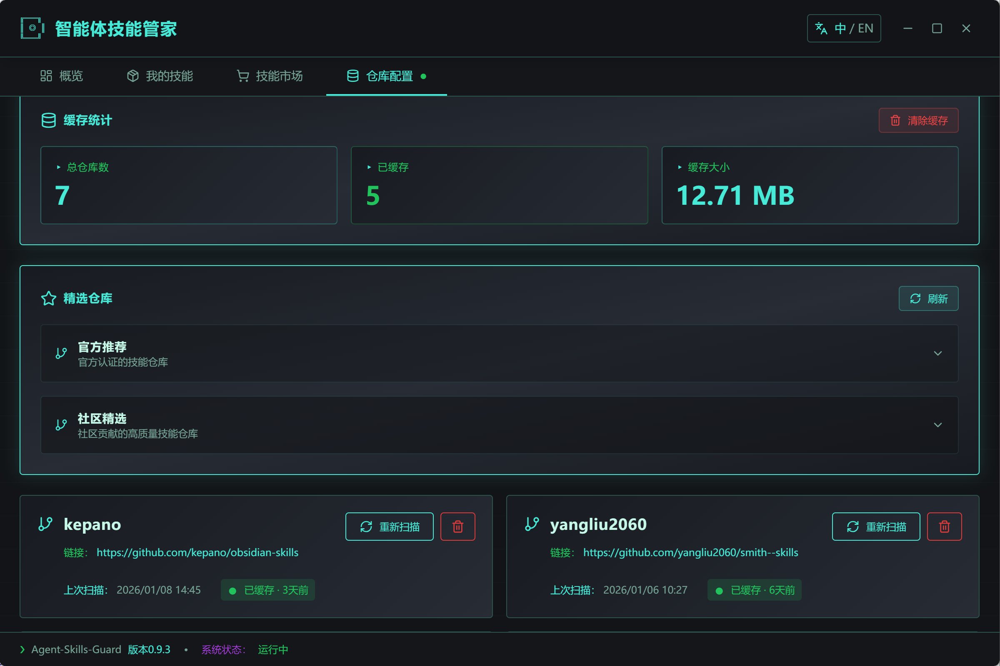
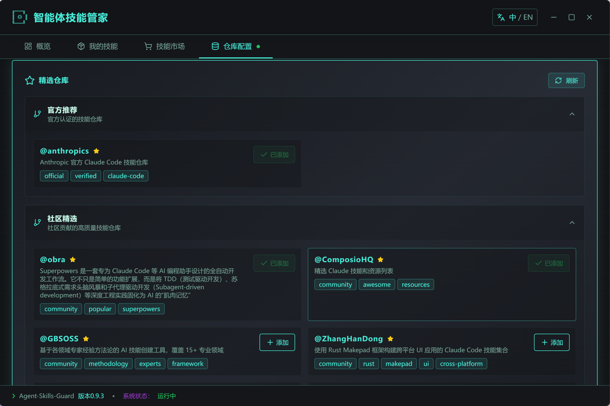
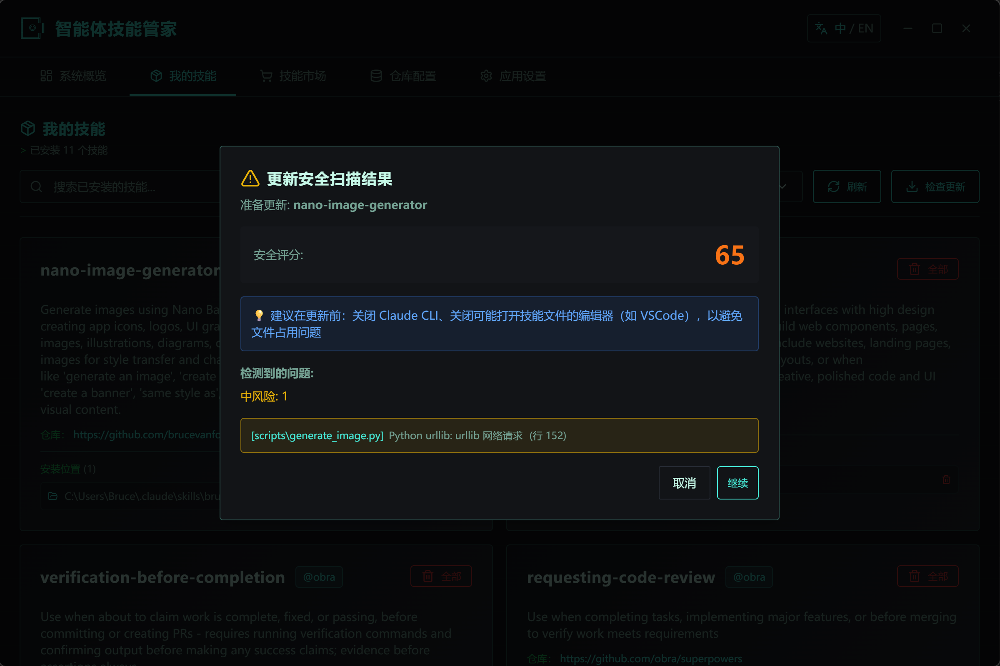

## 🎉 v1.0.1 正式版发布！

> **2026-01-25 发布**

### ✨ 新增功能
- 🔄 **技能同步优化**：支持在已安装的 AI 工具之间直接同步技能，无需重复下载和扫描，速度更快。
- 🌿 **仓库分支支持**：支持扫描和下载 GitHub 仓库的特定分支（如 `.../tree/dev`），更灵活地管理非默认分支的技能。
- 🌍 **全面中文化**：技能同步页面和市场页面新增完整中文翻译，体验更友好。

### 🐛 问题修复
- 修复了技能同步时提示 `sync_skill` 命令未找到的问题
- 修复了同步成功/失败提示信息的翻译缺失
- 修复了部分界面按钮和状态的文案问题

### 📥 历史更新 (v1.0.0)

> **2026-01-22 更新**

### ✨ 新功能
- 🌐 **技能市场翻译功能** - 支持一键翻译技能描述，使用 Google Translate 后端服务
- 🔄 **原文/译文切换** - 可随时在原文和译文之间切换查看
- 💾 **翻译缓存** - 翻译结果本地缓存，避免重复请求
- 🔧 **新增工具支持**：
  - Qoder (`~/.qoder/`)
  - Antigravity (`~/.antigravity/`)
  - Trae (`~/.trae/`)

### 🐛 问题修复
- 修复技能市场重复显示问题
- 修复翻译参数错误和缓存切换无响应的问题
- 优化翻译功能体验与范围
- GitHubService 使用代理配置解决下载失败问题

---

# 🛡️ Agent Skills Guard

### 让 Claude Code 技能管理像应用商店一样简单安全

[](https://github.com/brucevanfdm/agent-skills-guard/releases)
[](LICENSE)
[](https://github.com/brucevanfdm/agent-skills-guard/releases)

[English](README_EN.md) | 简体中文

---

## ⚡ 为什么选择 Agent Skills Guard？

当你享受 Claude Code 的 AI 辅助编程时，是否遇到这些困扰：

- 🔐 **安全顾虑**：想安装新技能，但担心代码风险，不知道如何判断？
- 📦 **管理混乱**：技能散落在各处，不知道哪些该留、哪些该删？
- 🔍 **发现困难**：不知道去哪找优质的社区技能，错过了很多好工具？

**Agent Skills Guard** 专为你解决这些问题。它把原本隐藏在命令行和文件夹中的技能世界，变成了一个**可视化、可管理、可信赖**的应用商店体验。


**🎯 三秒钟了解核心价值：可视化管理 + 安全扫描 + 精选仓库**

[⭐ 立即下载](https://github.com/brucevanfdm/agent-skills-guard/releases) | [📖 使用教程](#-快速开始)


---

## 🌟 四大核心特色

### 🔄 全生命周期管理

像管理手机应用一样管理 Claude Code 技能，从发现、安装、更新到卸载，全流程可视化操作。

- ✅ **一键安装**：从精选仓库或自定义仓库直接安装
- 🔄 **智能更新**：自动检测技能更新，支持在线升级
- 🗑️ **轻松卸载**：支持多路径安装管理，按需清理
- 📂 **自定义路径**：灵活选择技能安装位置

### 🛡️ 业界领先安全扫描

**覆盖 8 大风险类别，10 项硬触发保护**，让技能使用更安心。

- 🔍 **8 大风险类别**：破坏性操作、远程代码执行、命令注入、网络外传、权限提升、持久化、敏感信息泄露、敏感文件访问
- 🚫 **10 项硬触发规则**：高危操作直接阻止，不让用户冒险
- 🔗 **符号链接检测**：防止符号链接攻击
- 📊 **安全评分系统**：0-100 分直观展示，一目了然
- 📝 **详细扫描报告**：告诉你哪里有风险、为什么有风险、如何修复
- 🎯 **置信度分级**：High/Medium/Low 三级置信度，减少误报

### 🌟 精选技能仓库

内置人工精选的优质技能仓库，自动同步更新，发现优质技能从未如此简单。

- 📚 **精选技能库**：人工精心筛选的优质技能
- 🔄 **自动刷新**：启动时静默更新，保持最新
- ➕ **自定义仓库**：支持添加任意 GitHub 仓库

### 🎨 现代化可视化管理

告别命令行，享受苹果简约风格的直观界面。

- 🎨 **苹果简约主题**：清爽的 macOS 风格设计
- 📱 **侧边栏导航**：直观的导航体验
- ⚡ **流畅动画**：精心打磨的交互体验
- 🌐 **中英双语**：完整的中英文界面支持
- 📐 **响应式布局**：完美适配各种屏幕尺寸

---

## 🆚 传统方式 vs Agent Skills Guard

| 功能场景           | 传统方式                    | Agent Skills Guard           |
| ------------------ | --------------------------- | ---------------------------- |
| **发现技能** | ❌ 漫无目的地搜索 GitHub    | ✅ 精选仓库，一键浏览        |
| **安全检查** | ❌ 手动阅读代码，耗时易遗漏 | ✅ 8大类别自动扫描，秒出结果 |
| **安装技能** | ❌ 命令行操作，容易出错     | ✅ 可视化界面，点击即装      |
| **管理技能** | ❌ 文件夹翻找，不知道用途   | ✅ 直观列表，状态一目了然    |
| **更新技能** | ❌ 手动检查，重复操作       | ✅ 自动检测，批量更新        |
| **卸载技能** | ❌ 手动删除，担心残留       | ✅ 一键卸载，自动清理        |

---

## 🚀 快速开始

### 📥 安装

访问 [GitHub Releases](https://github.com/brucevanfdm/agent-skills-guard/releases) 下载最新版本：

- **macOS**：下载 `.dmg` 文件，拖拽安装
- **Windows**：下载 `.msi` 安装包，双击安装


*初次启动若提示安全警告，请放心忽略*


### 🎯 第一次使用

**第一步：配置仓库**

打开应用，你会看到内置的精选技能仓库。你也可以：

- 点击「仓库配置」添加你喜欢的 GitHub 仓库
- 等待自动扫描完成（支持手动刷新）

**第二步：浏览和安装**

- 在「技能市场」浏览和搜索技能
- 点击「安装」，系统会自动进行安全扫描
- 查看安全评分和扫描报告，放心安装

**第三步：管理已安装技能**

- 在「概览」页面一键扫描所有技能的安全状态
- 在「我的技能」查看详细信息、更新或卸载

## 💎 界面展示

### 📊 概览页面 - 一键安全扫描

一眼看清所有技能的安全状态，风险分类统计，问题详情一览无余。



### 🛡️ 安全扫描报告

详细的扫描结果，包含安全评分、风险等级、问题列表。



### 📦 我的技能

查看所有已安装技能，支持多路径管理、批量更新和卸载。


### 🛒 技能市场

从精选仓库探索和安装社区技能。



### 🗄️ 仓库配置

添加和管理技能来源，内置精选仓库自动更新。





---

## 🛡️ 安全扫描详解

### 扫描机制

我们的安全扫描引擎会分析技能代码的每个文件，检测潜在风险：

- **文件扫描策略**：跳过 `node_modules`、`target` 等大目录，限制扫描深度和文件数量
- **符号链接检测**：发现符号链接立即触发硬阻止，防止攻击
- **多格式支持**：支持 `.js`、`.ts`、`.py`、`.sh`、`.rs` 等多种代码格式

### 风险分类

| 类别                   | 检测内容               | 示例                              |
| ---------------------- | ---------------------- | --------------------------------- |
| **破坏性操作**   | 删除系统文件、磁盘擦除 | `rm -rf /`、`mkfs`            |
| **远程代码执行** | 管道执行、反序列化攻击 | `curl \| bash`、`pickle.loads` |
| **命令注入**     | 动态命令拼接           | `eval()`、`os.system()`       |
| **网络外传**     | 数据外传到远程服务器   | `curl -d @file`                 |
| **权限提升**     | 提权操作               | `sudo`、`chmod 777`           |
| **持久化**       | 后门植入               | `crontab`、SSH 密钥注入         |
| **敏感信息泄露** | 硬编码密钥、Token      | AWS Key、GitHub Token             |
| **敏感文件访问** | 访问系统敏感文件       | `~/.ssh/`、`/etc/passwd`      |

### 评分系统

- **90-100 分（✅ 安全）**：可放心使用
- **70-89 分（⚠️ 低风险）**：轻微风险，建议查看详情
- **50-69 分（⚠️ 中等风险）**：有一定风险，谨慎使用
- **30-49 分（🔴 高风险）**：风险较高，不建议安装
- **0-29 分（🚨 严重风险）**：严重威胁，禁止安装

### 免责声明

安全扫描基于预设规则，旨在帮助识别潜在风险，但不能保证 100% 准确，可能存在误报或漏报。建议在安装前仔细阅读技能源代码，对来自不可信来源的技能格外谨慎。使用本程序所带来的所有后果由用户自行承担。

---

## 💡 使用场景

### 场景一：发现新技能

你在 GitHub 上看到一个能自动生成代码注释的技能，想试试但又担心安全。

**使用 Agent Skills Guard：**

1. 在「技能市场」搜索这个技能
2. 点击「安装」，系统自动扫描
3. 看到安全评分是 85 分，有 2 个低风险提示
4. 查看详情后觉得可以接受，点击「仍然安装」
5. 安装成功，安心使用

### 场景二：定期安全检查

每个月，你想检查一下已安装技能的安全状态。

**使用 Agent Skills Guard：**

1. 打开「概览」页面
2. 点击「一键扫描」
3. 查看扫描报告，发现某个技能的安全评分下降
4. 查看详情发现该技能新增了网络请求代码
5. 决定卸载该技能或回滚到旧版本
6. 技能库保持安全可控

### 场景三：技能大清理

你的技能目录里堆满了各种技能，想清理一下。

**使用 Agent Skills Guard：**

1. 打开「我的技能」页面
2. 浏览所有技能及其功能描述
3. 看到有几个技能早已忘记用途
4. 选中这些技能，点击「卸载」
5. 技能库焕然一新

---

## ❓ 常见问题

### Q: 安全扫描会误报吗？

A: 有可能。扫描基于规则匹配，可能将无害代码标记为风险。建议查看扫描报告中的代码上下文，判断是否真的存在风险。

### Q: 我可以添加自己的技能仓库吗？

A: 可以！在「仓库配置」页面添加任意 GitHub 仓库，应用会自动扫描并发现其中的技能。

### Q: 应用会自动更新吗？

A: 是的，应用会自动检测更新，并在有新版本时提示你安装。

### Q: 技能安装到哪里了？

A: 默认安装到 `~/.claude/skills/`，你也可以在安装时选择自定义路径，支持安装到项目文件夹。

---

## 📝 更新日志

[查看完整更新日志](https://github.com/brucevanfdm/agent-skills-guard/releases)

---

## 🗺️ 开发计划

- [ ] 同名技能管理：智能处理同名技能的兼容性
- [ ] 增强安全扫描：更多维度的安全检测
- [ ] 技能评分系统：社区评分和使用统计
- [ ] 更多新特性

---

## 📦 下载与反馈

### 下载

- 📦 [GitHub Releases](https://github.com/brucevanfdm/agent-skills-guard/releases) - 获取最新版本

### 联系方式

有问题或建议？欢迎通过以下方式联系：

- 💬 [GitHub Issues](https://github.com/brucevanfdm/agent-skills-guard/issues) - 报告问题或提出功能建议
- 🐦 [X/Twitter](https://x.com/brucevanfdm) - 关注项目动态
- 💬 **Agent Skills 安全交流群**


---

## 🔧 开发者

如果你是开发者，想自行编译或贡献代码：

```bash
# 1. 克隆项目
git clone https://github.com/brucevanfdm/agent-skills-guard.git
cd agent-skills-guard

# 2. 安装依赖（需要 pnpm）
pnpm install

# 3. 开发模式运行
pnpm dev

# 4. 构建生产版本
pnpm build
```

**技术栈**：React 18 + TypeScript + Tauri 2 + Tailwind CSS

---

## 📜 许可证

MIT License - 自由使用，自由分享

---


Made with ❤️ by [Bruce](https://github.com/brucevanfdm)

如果这个项目对你有帮助，请给个 ⭐️ Star 支持一下！

[⬆ 回到顶部](#readme-top)


